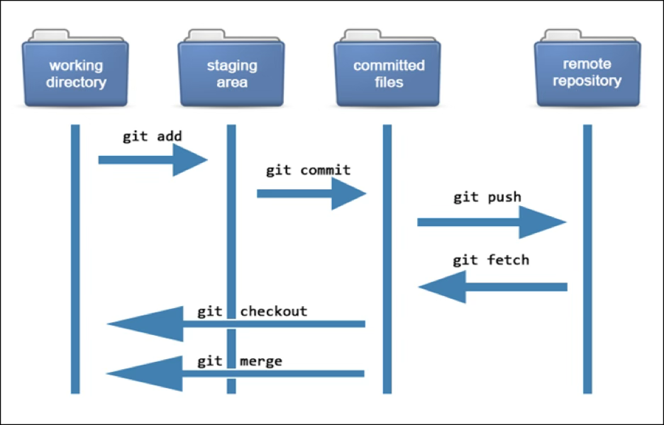

# What is Git?
Git is a distributed version control system (VCS). It helps developers track changes in source code during software development.simultaneously without interfering with each other’s work.

## Key Features of Git
- VERSION CONTROL: Track changes to files over time. 
- Distributed System: Every developer has a full copy of the repository.
- Branching & Merging: You can create branches for new features and merge them back.
- Staging Area: You can decide which changes to commit.
- Collaboration: Multiple developers can work on the same project.

# How Git Works (Architecture Overview)

Git tracks changes using snapshots, not differences.
Each time you commit, Git takes a snapshot of your entire project and links it to the previous one.

## The Three Git States:

Working Directory → your local files.

Staging Area (Index) → where changes are prepared for commit.

Repository (.git folder) → stores the project history.

[Working Directory] → git add → [Staging Area] → git commit → [Repository]

# What is GitHub?
- GitHub is a cloud-based platform that hosts Git repositories online.
- It provides tools for collaboration, code review, and project management.

# Key Features of GitHub

- Hosts Git repositories online.
- Allows multiple users to collaborate. 
- Pull Requests for merging code.
- Issues and Project Boards for task tracking.
- Actions for CI/CD (automation of testing & deployment).

#  Feature	                  Git	                            GitHub
- Type	                Version Control System	            Hosting Service
- Internet Required	            No	                               Yes
- Installed on	          Local Computer	                 Cloud (Website)
- Purpose	             Track code changes	               Store and share Git repositories
- Command Line	             Yes	                         Web Interface (GUI)
- Example	              git init, git commit	            github.com/username/repo

# Term	                   Meaning
+ Git	                Version control tool
+ GitHub	        Platform to host Git repositories
+ Commit	                  Save point
+ Branch	         Separate development line
+ Merge	               Combine branches
+ Push/Pull	      Upload/Download changes
+ Clone	                 Copy repo
+ Fork	     Copy someone else’s repo to your account

## Important Git Concepts
- Repository: A directory that stores your project.
- Commit: A snapshot of changes.
- Branch: A parallel version of your project.
- Merge: Combine changes from different branches.
- HEAD: Pointer to the latest commit.
- Fork: Copy of someone’s GitHub repo under your account.
- Pull Request (PR): A request to merge code from one branch to another.
- Issue: Used for tracking bugs or tasks.

 # GitHub Security Features
 
- SSH keys for secure access.
- 2FA (Two-Factor Authentication).
- Branch protection rules to prevent accidental changes.
- Private Repositories for restricted access.
  
# Real-Life Uses
- Track code history
- Collaborate with team
- Backup your work
- Manage open-source projects
- Contribute to others' projects

# GitHub Actions (Automation)
- You can automate tasks such as:
- Running tests
- Deploying apps
- Building CI/CD pipelines
- Example file: .github/workflows/main.yml
